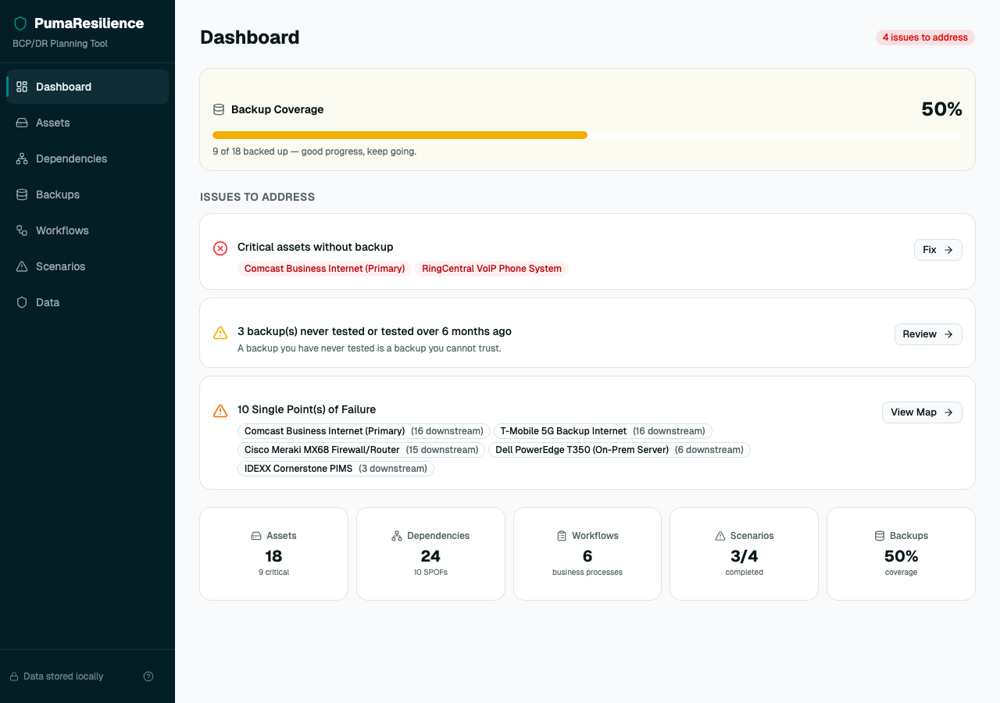
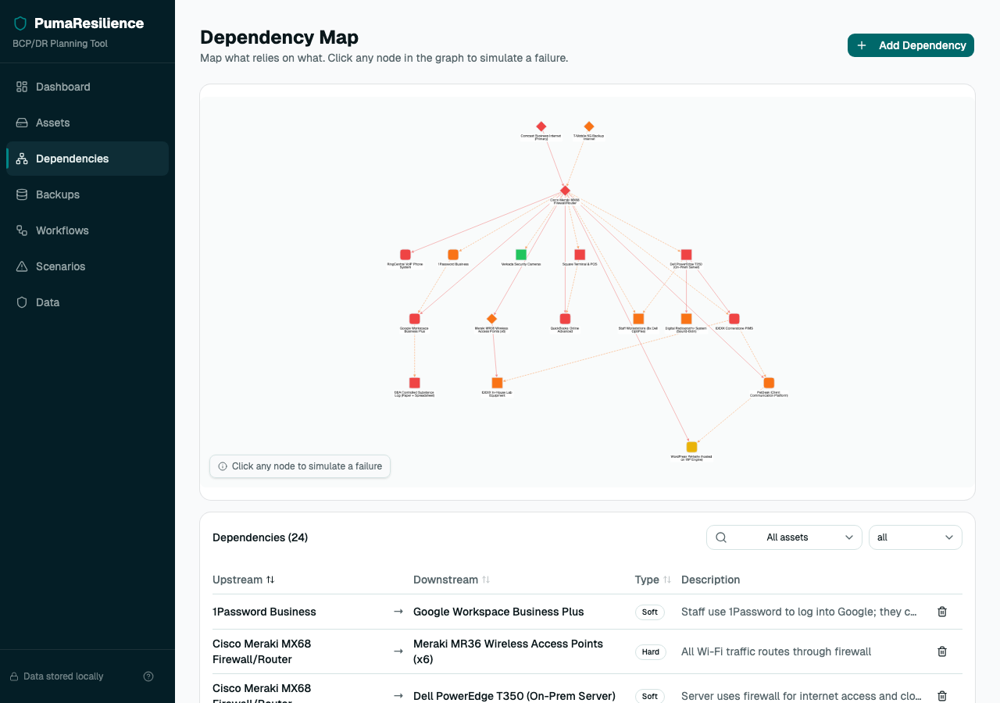
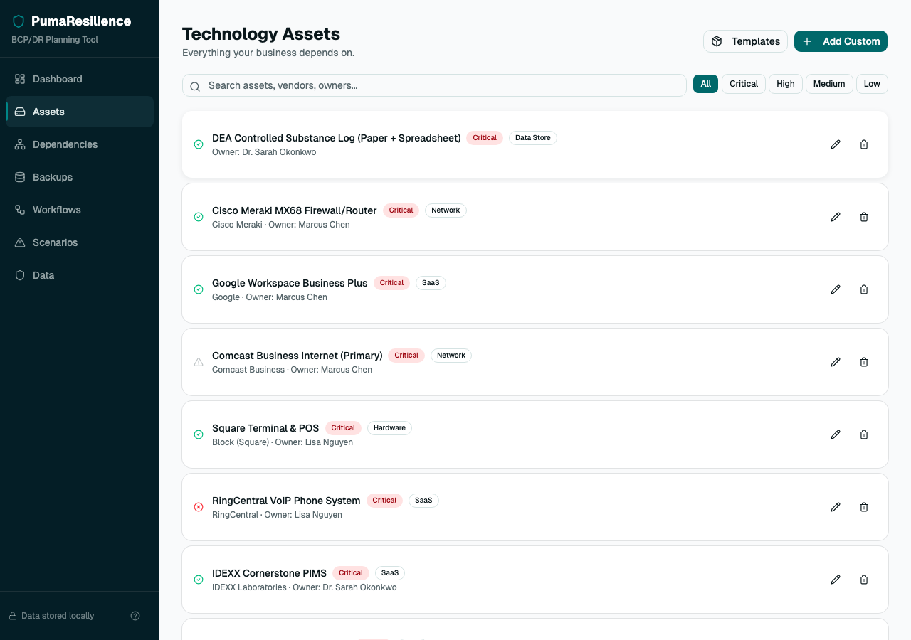
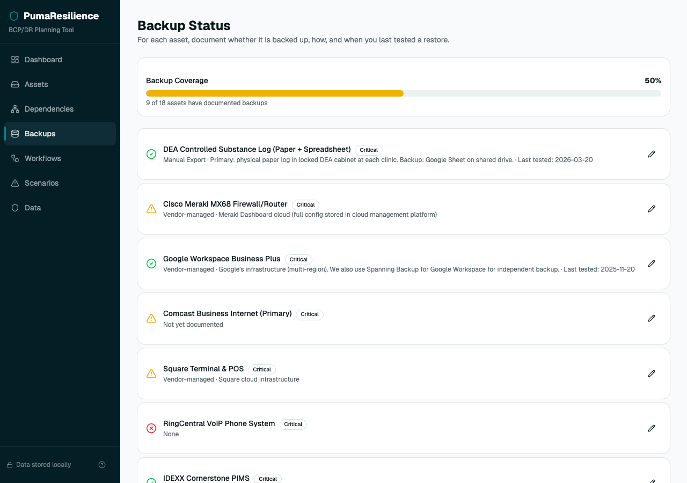
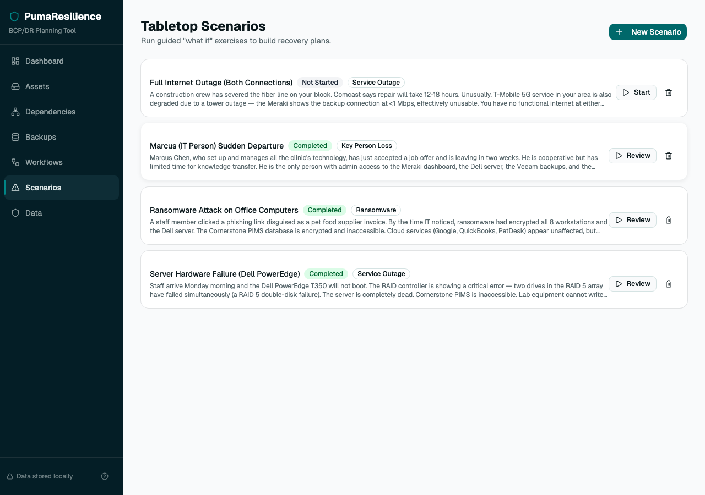

# PumaResilience

**Business Continuity & Disaster Recovery Planning Tool**

A local-first web app that helps small businesses inventory their technology, map dependencies, and run guided tabletop exercises to build actionable recovery plans. Think of it as a facilitated tabletop exercise in a browser.

Built for IT consultants, security professionals, and business owners who need a practical BCP/DR tool without enterprise pricing or complexity.

## Screenshots

**Dashboard** — At-a-glance view of backup coverage, critical issues, single points of failure, and key metrics.



**Dependency Map** — Interactive directed graph showing asset relationships. Click any node to simulate a failure and watch the cascade ripple downstream.



**Technology Assets** — Catalog of all technology assets with criticality levels, categories, and ownership tracking.



**Backup Status** — Traffic-light tracking for every asset's backup state with coverage percentage.



**Tabletop Scenarios** — Guided "what if" exercises with step-by-step facilitation and completion tracking.



## What It Does

- **Asset Inventory** — Catalog your technology with 36 pre-built templates (Google Workspace, QuickBooks, Shopify, Square POS, etc.) or add custom entries. Each asset tracks vendor info, support contacts, criticality level, and owner.

- **Dependency Mapping** — Interactive directed graph showing what relies on what. Click any node to simulate a failure and watch the cascade ripple downstream. Identifies single points of failure automatically.

- **Backup Status Tracking** — Traffic-light indicators for every asset: backed up and tested (green), backed up but untested (yellow), no backup (red). Coverage percentage on the dashboard makes gaps obvious.

- **Workflow Documentation** — Map business processes to the technology they depend on. Document max tolerable downtime, revenue impact, and manual workarounds (what can staff do with pen and paper?).

- **Tabletop Scenarios** — Guided 7-step "what if" exercises: Setup, Impact, Response, Recovery, Backups, Gaps, Actions. Pre-built scenarios include ransomware, internet outage, email provider down, key person departure, vendor shutdown, payment processing failure, and office inaccessible.

- **Recovery Plan Export** — Generate a printable PDF with asset inventory, dependency map, backup status, workflows, scenario playbooks, and contact directory. Also exports/imports JSON for data backup.

## Quick Start

```bash
git clone https://github.com/shandower-421/pumaresilience.git
cd pumaresilience
npm install
npm run dev
```

Open `http://localhost:5173` in your browser.

### Load Demo Data

A complete demo dataset is included (`demo-data.json`) featuring a fictional veterinary clinic with 18 assets, 24 dependencies, 11 backup records, 6 workflows, and 4 tabletop scenarios (3 completed with detailed exercise notes).

To load it: go to **Data** > **Choose JSON File** > select `demo-data.json`.

## Data Storage

All data is stored in your browser's IndexedDB. Nothing is sent to any server. There is no backend, no accounts, no telemetry.

**This means:**
- Your data is private by default
- It works offline after initial page load
- Clearing your browser data will erase everything
- Export JSON regularly as your backup
- Do not store passwords, API keys, or secrets in any field

## Tech Stack

| Layer | Technology |
|-------|-----------|
| Framework | React 19 + TypeScript |
| Build | Vite 8 |
| UI | Tailwind CSS 4 + Shadcn/ui (Base UI) |
| Database | Dexie.js (IndexedDB) |
| Graph | Cytoscape.js + dagre layout |
| PDF | jsPDF + jspdf-autotable |
| State | React hooks + Dexie live queries |

Pages are lazy-loaded with React Suspense. Cytoscape and jsPDF are code-split and only load when you visit those pages.

## Project Structure

```
src/
  components/
    ui/              # Shadcn/ui (Base UI) components
    HelpModal.tsx    # Help & About dialog
  db/
    database.ts      # Dexie.js schema
    types.ts         # TypeScript interfaces
    templates.ts     # Asset and scenario templates
    export-import.ts # JSON export/import
  lib/
    graph-engine.ts  # Cascade computation, topological sort, SPOF detection
    pdf-export.ts    # PDF recovery plan generation
    utils.ts         # Tailwind class merging
  pages/
    DashboardPage.tsx
    AssetsPage.tsx
    DependenciesPage.tsx
    BackupsPage.tsx
    WorkflowsPage.tsx
    ScenariosPage.tsx
    DataPage.tsx
  demo-data-loader.ts # Auto-loads demo data in demo mode
  App.tsx              # Shell, routing, responsive sidebar
```

## Building for Production

```bash
npm run build
```

Output goes to `dist/`. Serve with any static file server:

```bash
npx serve dist
```

Additional build modes:

- `npm run build:standalone` — single-file build (all assets inlined) to `dist-standalone/`
- `npm run build:demo` — demo mode build (import/export/clear disabled, demo data auto-loaded) to `dist-demo/`

## License

This tool is provided as-is, with no warranties or guarantees of any kind. See the About tab in the app for the full disclaimer.

Built by [Greykit.com](https://www.greykit.com)
